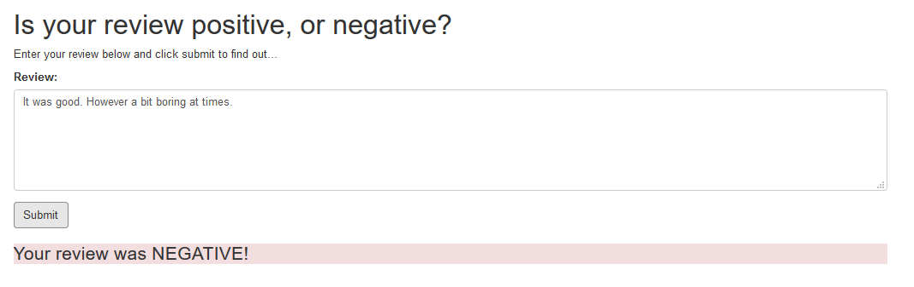

# AWS-WebApp-NLP-IMDB-Sentiment-Analysis

In this project we will use Amazon's SageMaker service to construct a random tree model to predict the sentiment of a movie review. In addition, we will deploy this model to an endpoint and construct a very simple web app which will interact with our model's deployed endpoint.

Project stages:

1. Retrieve the dataset
2. Preprocess and feature engineering
3. Upload the processed data to S3
4. Train a XGBoost model
5. Test the trained model
6. Deploy the trained model
7. Use the deployed model via Lambda function

### Setting up AWS Lambda

### Setting up Amazon API Gateway

### Additional webapp reviews

